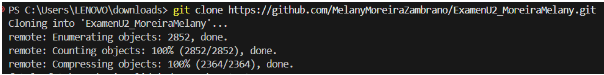
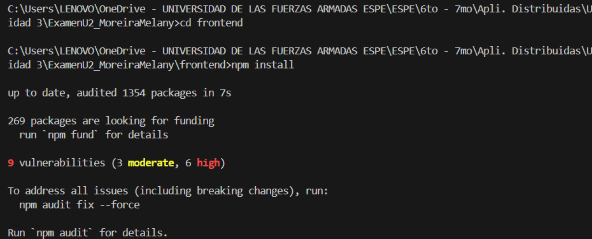

# INFORME DE PRÁCTICA DE LABORATORIO

| **DEPARTAMENTO:** Ciencias de la Computación | **CARRERA:** Ingeniería en Tecnologías de la Información |
|----------------------------------------------|----------------------------------------------------------|
| **ASIGNATURA:** Aplicaciones Distribuidas    | **NIVEL:** 7to           | **FECHA:** 6/08/2025     |
| **DOCENTE:** Ing. Paulo Galarza              | **PRÁCTICA N°:** 1 U3       | **CALIFICACIÓN:**         |

## Implementación de OAuth 2.0 para Autenticación de Terceros

**Melany Rosmery Moreira Zambrano**

---
## 🔗 Enlaces Importantes

- 🎥 **Video de Funcionamiento:** [Ver en Google Drive](https://drive.google.com/drive/folders/1MlohiNv0ST0SognR_BX7ZTjIBn66LatA?usp=sharing)  
- 💻 **Repositorio en GitHub:** [https://github.com/MelanyMoreiraZambrano/ExamenU2_MoreiraMelany.git](https://github.com/MelanyMoreiraZambrano/ExamenU2_MoreiraMelany.git)

---
## RESUMEN

En este trabajo, la aplicación web se diseñó para usar autenticación de terceros mediante OAuth 2.0, lo que facilita conexiones seguras y confiables a través de proveedores externos como Google. Se implementó un sistema de chat en tiempo real con Socket.IO, que permite la comunicación instantánea entre usuarios autenticados. La integración con JWT garantiza la validación y autorización de usuarios en el backend. El laboratorio proporcionó un conocimiento profundo de los mecanismos de autenticación y autorización, la comunicación cliente-servidor en tiempo real y la seguridad de las aplicaciones web modernas. Finalmente, se demostró que la implementación eficaz de OAuth 2.0 mejora la experiencia del usuario y la seguridad del sistema.

**Palabras Claves:** OAuth 2.0, autenticación, JWT.

---

## 1. INTRODUCCIÓN

El objetivo principal de este laboratorio fue implementar un sistema de autenticación seguro mediante el protocolo OAuth 2.0, que permite a los usuarios acceder a la aplicación a través de cuentas de terceros como Google. También se utilizó un chat en tiempo real para practicar la comunicación asíncrona entre clientes y servidores. Este laboratorio ayudó a reforzar el rigor del desarrollo y el uso adecuado de herramientas como Node.js, React y Socket.IO, promoviendo así buenas prácticas de programación y seguridad.

---

## 2. OBJETIVO(S)

- Utilizar la autenticación mediante OAuth 2.0 con Google como proveedor de autenticación.  
- Crear un backend que valide los tokens JWT y gestione sesiones seguras.  
- Comprender la integración entre el frontend y el backend mediante sockets para la comunicación instantánea.  

---

## 3. MARCO TEÓRICO

OAuth 2.0 es un protocolo de autorización estándar que permite a las aplicaciones obtener acceso limitado a recursos HTTP en nombre del usuario. Mediante flujos de autenticación, el usuario otorga la autorización sin compartir directamente sus credenciales. Los JWT (JSON Web Tokens) son pequeños objetos que permiten la verificación de identidad y la autorización. Socket.IO es una biblioteca que facilita la comunicación bidireccional en tiempo real entre el cliente y el servidor, lo cual resulta útil para aplicaciones como los chats.

---

## 4. DESCRIPCIÓN DEL PROCEDIMIENTO

La aplicación backend está configurada en Node.js y Express para recibir y validar los tokens JWT emitidos tras la autenticación mediante Google OAuth 2.0. La interfaz de React permite a los usuarios iniciar sesión a través de Google, almacenando el token JWT localmente. Tras iniciar sesión, el cliente se conecta al servidor Socket.IO con el token para validar la sesión. Se utilizan eventos para enviar y recibir mensajes en tiempo real, que se almacenan en MongoDB. Postman se utiliza para probar el endpoint RESTful y verificar las operaciones CRUD.

---

### Estructura del Proyecto

```
ExamenU2_MoreiraMelany/
│
├── backend/
│   ├── app.js
│   ├── server.js
│   ├── domain/models/message.model.js
│   ├── middlewares/authSocket.js
│   ├── routes/auth.routes.js
│   ├── controllers/auth.controller.js
│   └── utils/jwt.js
│
├── frontend/
│   └── src/
│       ├── components/
│       ├── pages/Dashboard.jsx
│       └── services/
│
├── .env
├── README.md
└── package.json
```

**Backend (Node.js + Express)**

- Express.js  
- MongoDB + Mongoose  
- Socket.IO  
- JWT  
- Passport.js + Google OAuth 2.0  

**Frontend (React)**

- React.js  
- Axios  
- Socket.IO Client  
- Google Identity  

---

## Instalación

1. Clonar el repositorio  
   `https://github.com/MelanyMoreiraZambrano/ExamenU2_MoreiraMelany.git`  
2. Backend  
   ```bash
   npm install
   ```
3. Frontend  
   ```bash
   cd frontend
   npm install
   ```

---

## Uso del proyecto

1. Crear el contenedor  
   ```bash
   docker-compose up -d
   ```

2. Iniciar el backend  
   ```bash
   npm start
   ```

3. Iniciar el frontend  
   ```bash
   npm start
   ```

Esto abre la app en: `http://localhost:3000`

---

## 5. Análisis de Resultados
Se detecta una conexión exitosa con el proveedor OAuth y un token de inicio de sesión válido. El chat en tiempo real
ofrece una mejor sincronización de mensajes entre varios clientes abiertos en diferentes navegadores o pestañas.
Los mensajes se almacenan correctamente en la base de datos y los permisos se aprueban mediante JWT. Esto
garantiza que solo los usuarios autorizados puedan enviar y recibir mensajes, lo que indica un sistema seguro y
funcional.

## 6. GRÁFICOS O FOTOGRAFÍAS
**Clonar repositorio**  

**Dependencias - Backend**  

**Ejecución - Backend**  

**Carpeta del Frontend**  

**Ejecución - Frontend**  

**Redirige a Google**  

**Página de autenticación de la Institución**  

**Confirmación de Autenticación**  

**Ingreso desde dos ventanas distintas con diferentes usuarios**  

**JWT desde herramientas del desarrollador**  

**Verificación del perfil creado desde google desde la consola**  


## 7. DISCUSIÓN 
Esta implementación demuestra la eficacia del protocolo OAuth 2.0 para proporcionar autenticación a terceros de
confianza, simplificando así la gestión de usuarios. También se reconoce la importancia de utilizar JWT adecuados
para proteger rutas y recursos en el backend. El uso de Socket.IO facilita una comunicación eficiente en tiempo real,
crucial para las aplicaciones de mensajería. Se presentan problemas relacionados con la sincronización y la gestión
de tokens, que se abordan con middleware y eventos adecuados.

## 8. CONCLUSIONES
Se ha logrado el objetivo de implementar la autenticación segura mediante OAuth 2.0 y crear un sistema de chat en
tiempo real compatible con múltiples usuarios. Este sistema garantiza que solo los usuarios autorizados puedan
acceder a las funciones, garantizando así la integridad y seguridad de los datos. Esta práctica mejora el conocimiento
de los protocolos de validación, el desarrollo back-end y front-end, y la gestión de la comunicación en tiempo real.

## 9. BIBLIOGRAFÍA
- Hardt, D. (2012). *The OAuth 2.0 Authorization Framework*. IETF RFC 6749. [https://tools.ietf.org/html/rfc6749](https://tools.ietf.org/html/rfc6749)  
- JWT.io. (2024). *Introduction to JSON Web Tokens*. [https://jwt.io/introduction](https://jwt.io/introduction)  
- Socket.IO. (2024). *Socket.IO Documentation*. [https://socket.io/docs/](https://socket.io/docs/)  
- Google Developers. (2024). *Google Identity Platform - OAuth 2.0*. [https://developers.google.com/identity/protocols/oauth2](https://developers.google.com/identity/protocols/oauth2)
